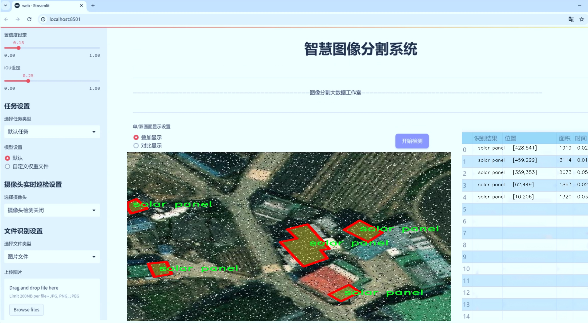
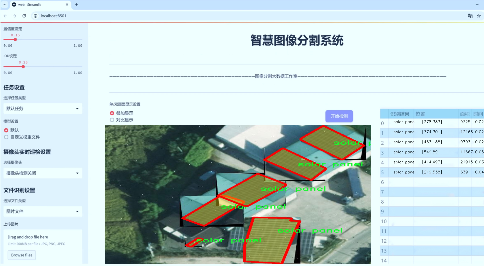
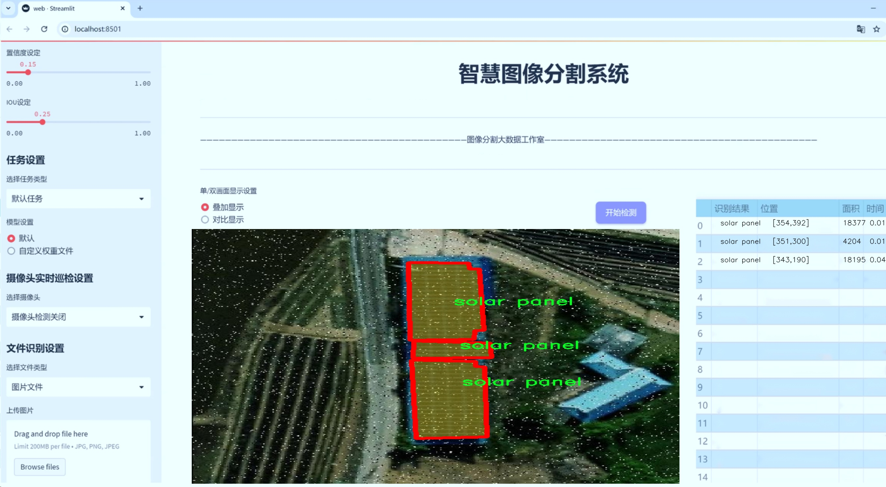
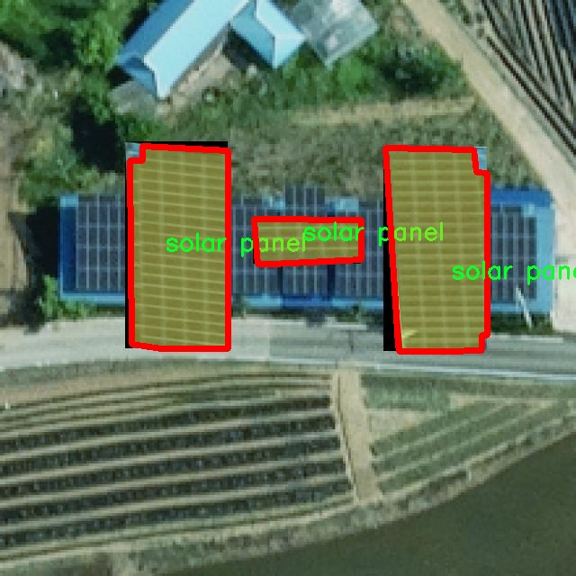
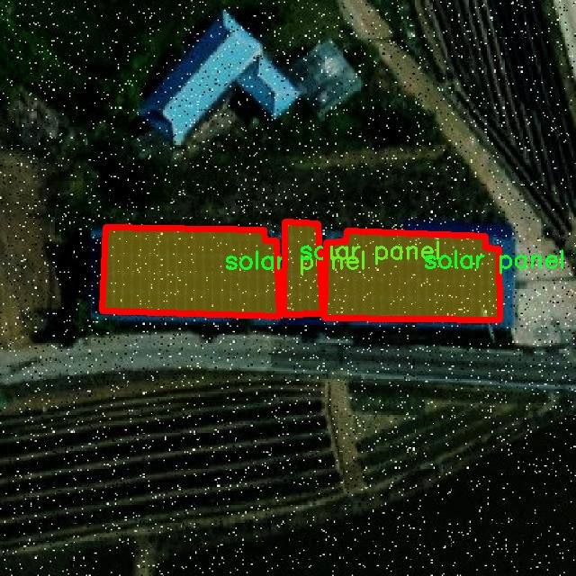
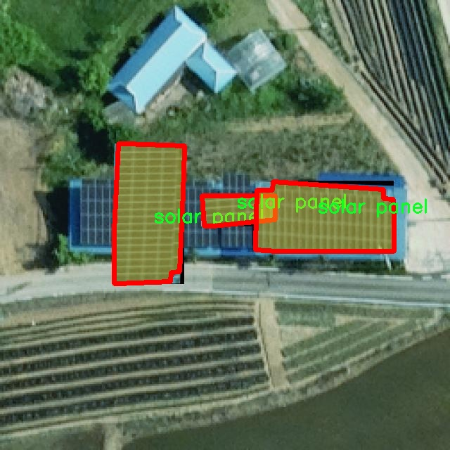

# 光伏面板分割系统源码＆数据集分享
 [yolov8-seg-C2f-EMSC＆yolov8-seg-act等50+全套改进创新点发刊_一键训练教程_Web前端展示]

### 1.研究背景与意义

项目参考[ILSVRC ImageNet Large Scale Visual Recognition Challenge](https://gitee.com/YOLOv8_YOLOv11_Segmentation_Studio/projects)

项目来源[AAAI Global Al lnnovation Contest](https://kdocs.cn/l/cszuIiCKVNis)

研究背景与意义

随着全球对可再生能源的日益重视，光伏发电作为一种清洁、可再生的能源形式，得到了广泛的应用。光伏面板的安装和维护是确保光伏系统高效运行的关键环节。为了提高光伏面板的检测和维护效率，计算机视觉技术的应用变得尤为重要。近年来，深度学习特别是卷积神经网络（CNN）在图像处理领域取得了显著的进展，其中目标检测和实例分割技术在各类视觉任务中表现优异。YOLO（You Only Look Once）系列模型以其快速的推理速度和高精度的检测能力，成为了目标检测领域的热门选择。YOLOv8作为该系列的最新版本，进一步提升了模型的性能，尤其在处理复杂场景和小目标检测方面展现出强大的能力。

在光伏面板的检测与分割任务中，准确识别和分割光伏面板是实现自动化监测和故障诊断的基础。现有的光伏面板检测方法多依赖于传统的图像处理技术，存在对光照变化、遮挡和背景复杂性等因素的敏感性，导致检测精度和效率的不足。因此，基于改进YOLOv8的光伏面板分割系统的研究显得尤为重要。通过引入深度学习技术，尤其是实例分割模型，可以实现对光伏面板的精确定位和轮廓提取，从而为后续的故障检测和性能评估提供可靠的数据支持。

本研究将利用PVseg - High Zoom - NL - v1数据集，该数据集包含4200张高分辨率图像，涵盖11个类别，包括光伏面板及其相关组件。数据集的丰富性和多样性为模型的训练和验证提供了良好的基础，能够有效提升模型在实际应用中的泛化能力。此外，数据集中对光伏面板的多样化标注，能够帮助模型学习到不同光照条件、视角和背景下的特征，进一步增强模型的鲁棒性。

通过对YOLOv8模型的改进与优化，本研究旨在提升光伏面板的分割精度和处理速度，为光伏系统的智能监测和维护提供有效的技术支持。研究成果不仅能够推动光伏发电领域的技术进步，还能为其他相关领域的图像分割任务提供借鉴。综上所述，基于改进YOLOv8的光伏面板分割系统的研究具有重要的理论价值和实际意义，能够为实现光伏产业的智能化发展贡献力量。

### 2.图片演示







##### 注意：由于此博客编辑较早，上面“2.图片演示”和“3.视频演示”展示的系统图片或者视频可能为老版本，新版本在老版本的基础上升级如下：（实际效果以升级的新版本为准）

  （1）适配了YOLOV8的“目标检测”模型和“实例分割”模型，通过加载相应的权重（.pt）文件即可自适应加载模型。

  （2）支持“图片识别”、“视频识别”、“摄像头实时识别”三种识别模式。

  （3）支持“图片识别”、“视频识别”、“摄像头实时识别”三种识别结果保存导出，解决手动导出（容易卡顿出现爆内存）存在的问题，识别完自动保存结果并导出到tempDir中。

  （4）支持Web前端系统中的标题、背景图等自定义修改，后面提供修改教程。

  另外本项目提供训练的数据集和训练教程,暂不提供权重文件（best.pt）,需要您按照教程进行训练后实现图片演示和Web前端界面演示的效果。

### 3.视频演示

[3.1 视频演示](https://www.bilibili.com/video/BV1E52EYuEZm/)

### 4.数据集信息展示

##### 4.1 本项目数据集详细数据（类别数＆类别名）

nc: 1
names: ['solar panel']


##### 4.2 本项目数据集信息介绍

数据集信息展示

在本研究中，我们使用了名为“PVseg - High Zoom - NL - v1”的数据集，以训练和改进YOLOv8-seg模型，旨在实现高效的光伏面板分割系统。该数据集专门为光伏面板的检测与分割任务而设计，提供了高分辨率的图像和详细的标注信息，能够有效支持深度学习模型的训练和验证。

“PVseg - High Zoom - NL - v1”数据集的核心特征在于其类别数量的简洁性，只有一个类别，即“solar panel”。这一设计使得模型的训练过程更加聚焦，能够深入挖掘光伏面板的特征，提升分割精度。数据集中包含的图像经过精心挑选，涵盖了不同环境下的光伏面板，从而确保模型在多样化场景中的适应性和鲁棒性。通过高倍数的放大，数据集提供了细致的视觉信息，使得模型能够捕捉到光伏面板的微小特征和复杂形状。

数据集的图像数据来源广泛，涵盖了城市、乡村、工业区等多种场景，确保了数据的多样性和代表性。这种多样性不仅提高了模型的泛化能力，还增强了其在实际应用中的有效性。数据集中每一张图像都经过精确的标注，确保了光伏面板的边界清晰可辨，为模型的训练提供了可靠的基础。标注过程遵循严格的标准，确保了数据的高质量和一致性，使得模型在学习过程中能够获得准确的反馈。

在数据预处理阶段，我们对图像进行了标准化处理，包括尺寸调整、颜色归一化等，以适应YOLOv8-seg模型的输入要求。这一过程不仅提高了训练效率，还减少了模型对输入数据的敏感性，使得模型能够更好地适应不同的输入条件。此外，为了增强模型的鲁棒性，我们还采用了数据增强技术，如随机裁剪、旋转、翻转等，以增加训练样本的多样性，进一步提升模型的性能。

在训练过程中，我们采用了分层抽样的方法，以确保每个类别在训练集和验证集中的比例合理。这种方法能够有效避免类别不平衡带来的问题，确保模型在光伏面板分割任务中的表现更加稳定和可靠。通过对“PVseg - High Zoom - NL - v1”数据集的充分利用，我们期望能够显著提升YOLOv8-seg模型在光伏面板分割任务中的准确性和效率。

综上所述，“PVseg - High Zoom - NL - v1”数据集为光伏面板分割系统的训练提供了坚实的基础。其高质量的图像数据、明确的类别标注以及多样化的场景设置，使得我们能够在深度学习模型的训练过程中，充分挖掘光伏面板的特征，进而推动光伏面板检测技术的发展。通过对该数据集的深入研究和应用，我们期待能够在光伏面板的自动化检测和监测领域取得更大的突破，为可再生能源的利用和发展贡献力量。








### 5.全套项目环境部署视频教程（零基础手把手教学）

[5.1 环境部署教程链接（零基础手把手教学）](https://www.bilibili.com/video/BV1jG4Ve4E9t/?vd_source=bc9aec86d164b67a7004b996143742dc)


[5.2 安装Python虚拟环境创建和依赖库安装视频教程链接（零基础手把手教学）](https://www.bilibili.com/video/BV1nA4VeYEze/?vd_source=bc9aec86d164b67a7004b996143742dc)

### 6.手把手YOLOV8-seg训练视频教程（零基础小白有手就能学会）

[6.1 手把手YOLOV8-seg训练视频教程（零基础小白有手就能学会）](https://www.bilibili.com/video/BV1cA4VeYETe/?vd_source=bc9aec86d164b67a7004b996143742dc)


按照上面的训练视频教程链接加载项目提供的数据集，运行train.py即可开始训练



     Epoch   gpu_mem       box       obj       cls    labels  img_size
     1/200     0G   0.01576   0.01955  0.007536        22      1280: 100%|██████████| 849/849 [14:42<00:00,  1.04s/it]
               Class     Images     Labels          P          R     mAP@.5 mAP@.5:.95: 100%|██████████| 213/213 [01:14<00:00,  2.87it/s]
                 all       3395      17314      0.994      0.957      0.0957      0.0843

     Epoch   gpu_mem       box       obj       cls    labels  img_size
     2/200     0G   0.01578   0.01923  0.007006        22      1280: 100%|██████████| 849/849 [14:44<00:00,  1.04s/it]
               Class     Images     Labels          P          R     mAP@.5 mAP@.5:.95: 100%|██████████| 213/213 [01:12<00:00,  2.95it/s]
                 all       3395      17314      0.996      0.956      0.0957      0.0845

     Epoch   gpu_mem       box       obj       cls    labels  img_size
     3/200     0G   0.01561    0.0191  0.006895        27      1280: 100%|██████████| 849/849 [10:56<00:00,  1.29it/s]
               Class     Images     Labels          P          R     mAP@.5 mAP@.5:.95: 100%|███████   | 187/213 [00:52<00:00,  4.04it/s]
                 all       3395      17314      0.996      0.957      0.0957      0.0845


### 7.50+种全套YOLOV8-seg创新点代码加载调参视频教程（一键加载写好的改进模型的配置文件）

[7.1 50+种全套YOLOV8-seg创新点代码加载调参视频教程（一键加载写好的改进模型的配置文件）](https://www.bilibili.com/video/BV1Hw4VePEXv/?vd_source=bc9aec86d164b67a7004b996143742dc)

### 8.YOLOV8-seg图像分割算法原理

原始YOLOv8-seg算法原理

YOLOv8-seg算法是Ultralytics公司在2023年推出的最新版本，代表了YOLO系列目标检测和图像分割技术的又一次重大进步。其设计理念围绕着快速、准确和易于使用，致力于在各种计算机视觉任务中提供卓越的性能。YOLOv8-seg不仅继承了前几代YOLO算法的优点，还在网络结构、训练策略和损失函数等多个方面进行了创新和优化，使其在目标检测和图像分割任务中表现得更加出色。

YOLOv8-seg的网络结构可以分为三个主要部分：Backbone、Neck和Head。Backbone负责特征提取，Neck用于多尺度特征融合，而Head则负责最终的目标检测和分类任务。具体而言，Backbone部分采用了一系列卷积和反卷积层，通过残差连接和瓶颈结构来减小网络的大小并提高性能。该部分的核心构建单元是C2模块，这一模块在设计上借鉴了YOLOv7中的ELAN模块的思想，取代了YOLOv5中的C3模块，从而实现了更高的精度和更合理的延迟。

在Backbone中，YOLOv8-seg使用了5个CBS模块、4个C2f模块和1个快速空间金字塔池化(SPPF)模块。这种设计不仅增强了特征提取的能力，还提高了模型的整体性能。C2f模块通过并行化更多的梯度流分支，确保了在保持轻量化的同时获得更丰富的梯度信息，这对于目标检测和图像分割任务的准确性至关重要。

Neck部分则采用了多尺度特征融合技术，将来自Backbone不同阶段的特征图进行融合，以便更好地捕捉不同尺度目标的信息。这一过程不仅提高了目标检测的性能，还增强了模型在复杂场景下的鲁棒性。YOLOv8-seg在Neck部分的设计中，去除了YOLOv5中多余的上采样卷积连接层，直接对Backbone不同阶段输出的特征进行上采样操作，这一简化设计进一步提升了计算效率。

Head部分是YOLOv8-seg的关键所在，其结构经历了显著的变化。YOLOv8-seg采用了解耦合头结构，将目标检测和分类任务分开处理。这一设计的优势在于，分类和检测可以使用不同的卷积层进行处理，从而使得模型在学习时能够更专注于各自的任务。此外，YOLOv8-seg摒弃了传统的Anchor-Based方法，转而采用Anchor-Free的方法，将目标检测转化为关键点检测。这一创新使得模型在处理不同尺度和形状的目标时更加灵活，且不再需要在训练前对锚框进行预设，从而简化了网络结构。

在训练过程中，YOLOv8-seg引入了Mosaic图像增强操作，以提高模型的泛化能力。Mosaic增强通过随机选择四张图像进行缩放和拼接，生成新的训练样本，这一过程迫使模型不断学习新的位置和不同周围像素，显著提高了预测精度。此外，在训练的最后10轮中，YOLOv8-seg关闭了Mosaic增强，以确保模型在接近收敛时能够更好地稳定性能。

损失函数的设计也是YOLOv8-seg的一大亮点。YOLOv8-seg在分类分支中使用了二值交叉熵损失(BCELoss)，而在边界框回归分支中则采用了分布焦点损失(DFL)和CIoU损失的组合。这一设计旨在使网络模型快速聚焦到标签附近的数值，从而提高目标检测的准确性。

在输入端，YOLOv8-seg的默认输入图像尺寸为640x640，但在实际应用中，针对不同长宽比的图像，YOLOv8-seg采用自适应图像缩放技术，以提高目标检测和推理的速度。这一方法通过将长边按比例缩小到指定尺寸，并对短边进行填充，尽量减少信息冗余，确保了在不同场景下的有效性。

综上所述，YOLOv8-seg算法在多个方面进行了创新和优化，使其在目标检测和图像分割任务中展现出更强的性能和灵活性。通过改进的Backbone、Neck和Head结构，结合高效的训练策略和损失函数设计，YOLOv8-seg不仅能够快速准确地识别和分割目标，还能够适应多种复杂的应用场景。这些特性使得YOLOv8-seg成为当前计算机视觉领域中一款极具竞争力的算法，广泛应用于自动驾驶、智能监控、医疗影像分析等多个领域。


### 9.系统功能展示（检测对象为举例，实际内容以本项目数据集为准）

图9.1.系统支持检测结果表格显示

  图9.2.系统支持置信度和IOU阈值手动调节

  图9.3.系统支持自定义加载权重文件best.pt(需要你通过步骤5中训练获得)

  图9.4.系统支持摄像头实时识别

  图9.5.系统支持图片识别

  图9.6.系统支持视频识别

  图9.7.系统支持识别结果文件自动保存

  图9.8.系统支持Excel导出检测结果数据


### 10.50+种全套YOLOV8-seg创新点原理讲解（非科班也可以轻松写刊发刊，V11版本正在科研待更新）

#### 10.1 由于篇幅限制，每个创新点的具体原理讲解就不一一展开，具体见下列网址中的创新点对应子项目的技术原理博客网址【Blog】：


[10.1 50+种全套YOLOV8-seg创新点原理讲解链接](https://gitee.com/qunmasj/good)

#### 10.2 部分改进模块原理讲解(完整的改进原理见上图和技术博客链接)【如果此小节的图加载失败可以通过CSDN或者Github搜索该博客的标题访问原始博客，原始博客图片显示正常】
### YOLOv8模型原理

YOLOv8是YOLO系列最新的模型,具有非常优秀的检测精度和速度。根据网络的深度与特征图的宽度大小, YOLOv8算法分为:YOLOv8-n、YOLOv8一s 、YOLOv8-m 、 YOLOv8-l、和 YOLOv8-x 5个版本。按照网络结构图,YOLOv8可分为: Inpul 、 Backbone , Neck和Head 4部分。


Backbone采用了CSPDarknet 架构，由CBS (标准卷积层)、C2f模块和 SPPF(金字塔池化）组成。通过5次标准卷积层和C2f模块逐步提取图像特征，并在网络末尾添加SPPF模块，将任意大小的输入图像转换成固定大小的特征向量。分别取P3、P4、P5层的特征提取结果，向Head输出80×80、40 × 40、20×20三个尺度的特征层。
C2f模块借鉴了残差网络(ResNet)以及ELAN的思想，其结构分为两个分支，主干部分利用Bottleneckm2%模块逐步加深网络，分支部分保留输入层通道并与主干部分特征进行融合，如图所示。通过标准卷积层提取新的特征层，相比于YOLOv5使用的C3模块，C2f模块可以在卷积层和全连接层之间建立一个平滑的转换，从而实现了参数的共享，提高了模型的效率和泛化能力。
Head采用了PAN-FPN 结构,将 Backbone输入的3个特征层进行多尺度融合，进行自顶向下(FAN)和自底向上 (PAN)的特征传递，对金字塔进行增强，使不同尺寸的特征图都包含强目标语义信息和强目标特征信息，保证了对不同尺寸样本的准确预测。
Detect借鉴了Decoupled-Head 思想，用一个解耦检测头将输入的不同尺寸特征层分成2个分支进行检测。第1个分支在进行3次卷积后使进行回归任务，输出预测框。第2个分支在进行3次卷积后进行分类任务，输出类别的概率。采用Varifocal_Loss2”作为损失函数，其式为:


### Context_Grided_Network(CGNet)简介
参考该博客提出的一种轻量化语义分割模型Context Grided Network(CGNet)，以满足设备的运行需要。

CGNet主要由CG块构建而成，CG块可以学习局部特征和周围环境上下文的联合特征，最后通过引入全局上下文特征进一步改善联合特征的学习。


 
下图给出了在Cityscapes数据集上对现有的一些语义分割模型的测试效果，横轴表示参数量，纵轴表示准确率(mIoU)。可以看出，在参数量较少的情况下，CGNet可以达到一个比较好的准确率。虽与高精度模型相去甚远，但在一些对精度要求不高、对实时性要求比较苛刻的情况下，很有价值。


高精度模型，如DeepLab、DFN、DenseASPP等，动不动就是几十M的参数，很难应用在移动设备上。而上图中红色的模型，相对内存占用较小，但它们的分割精度却不是很高。作者认为主要原因是，这些小网络大多遵循着分类网络的设计思路，并没有考虑语义分割任务更深层次的特点。

空间依赖性和上下文信息对提高分割精度有很大的作用。作者从该角度出发，提出了CG block，并进一步搭建了轻量级语义分割网络CGNet。CG块具有以下特点： 

学习局部特征和上下文特征的联合特征；
通过全局上下文特征改进上述联合特征；
可以贯穿应用在整个网络中，从low level（空间级别）到high level（语义级别）。不像PSPNet、DFN、DenseASPP等，只在编码阶段以后捕捉上下文特征。；
只有3个下采样，相比一般5个下采样的网络，能够更好地保留边缘信息。
CGNet遵循“深而薄”的原则设计，整个网络又51层构成。其中，为了降低计算，大量使用了channel-wise conv.

小型语义分割模型：

需要平衡准确率和系统开销
进化路线：ENet -> ICNet -> ESPNet
这些模型基本都基于分类网络设计，在分割准确率上效果并不是很好
上下文信息模型：

大多数现有模型只考虑解码阶段的上下文信息并且没有利用周围的上下文信息
注意力机制：

CG block使用全局上下文信息计算权重向量，并使用其细化局部特征和周围上下文特征的联合特征

#### Context Guided Block
CG block由4部分组成：


此外，CG block还采用了残差学习。文中提出了局部残差学习（LRL）和全局残差学习（GRL）两种方式。 LRL添加了从输入到联合特征提取器的连接，GRL添加了从输入到全局特征提取器的连接。从直观上来说，GRL比LRL更能促进网络中的信息传递（更像ResNet~~），后面实验部分也进行了测试，的确GRL更能提升分割精度。


CGNet的通用网络结构如下图所示，分为3个stage，第一个stage使用3个卷积层抽取特征，第二和第三个stage堆叠一定数量的CG block，具体个数可以根据情况调整。最后，通过1x1 conv得到分割结果。


下图是用于Cityscapes数据集的CGNet网络细节说明：输入尺寸为3*680*680；stage1连续使用了3个Conv-BN-PReLU组合，首个组合使用了stride=2的卷积，所以得到了1/2分辨率的feature map；stage2和stage3分别使用了多个CG block，且其中使用了不同大小的膨胀卷积核，最终分别得到了1/4和1/8的feature map。

需注意：

stage2&3的输入特征分别由其上一个stage的首个和最后一个block组合给出（参考上图的绿色箭头）；

输入注入机制，图中未体现，实际使用中，作者还将输入图像下采样1/4或1/8，分别给到stage2和stage3的输入中 ，以进一步加强特征传递。

channel-wise conv。为了缩减参数数量，在局部特征提取器和周围上下文特征提取器中使用了channel-wise卷积，可以消除跨通道的计算成本，同时节省内存占用。但是，没有像MobileNet等模型一样，在depth-wise卷积后面接point-wise卷积（1*1 conv），作者解释是，因为CG block需要保持局部特征和周围上下文特征的独立性，而1*1 conv会破坏这种独立性，所以效果欠佳，实验部分也进行了验证。

个人感觉此处应该指的是depth-wise卷积？

官方Git中对该部分的实现如下：


### 11.项目核心源码讲解（再也不用担心看不懂代码逻辑）

#### 11.1 ultralytics\nn\modules\transformer.py

以下是对代码中最核心部分的提取和详细中文注释：

```python
import torch
import torch.nn as nn
import torch.nn.functional as F

class TransformerEncoderLayer(nn.Module):
    """定义单个Transformer编码器层。"""

    def __init__(self, c1, cm=2048, num_heads=8, dropout=0.0, act=nn.GELU(), normalize_before=False):
        """初始化TransformerEncoderLayer，指定参数。"""
        super().__init__()
        self.ma = nn.MultiheadAttention(c1, num_heads, dropout=dropout, batch_first=True)  # 多头自注意力机制
        self.fc1 = nn.Linear(c1, cm)  # 前馈网络的第一层
        self.fc2 = nn.Linear(cm, c1)  # 前馈网络的第二层
        self.norm1 = nn.LayerNorm(c1)  # 第一层归一化
        self.norm2 = nn.LayerNorm(c1)  # 第二层归一化
        self.dropout = nn.Dropout(dropout)  # dropout层
        self.dropout1 = nn.Dropout(dropout)  # dropout层
        self.dropout2 = nn.Dropout(dropout)  # dropout层
        self.act = act  # 激活函数
        self.normalize_before = normalize_before  # 是否在前面进行归一化

    def forward(self, src, src_mask=None, src_key_padding_mask=None, pos=None):
        """通过编码器模块前向传播输入。"""
        if self.normalize_before:
            return self.forward_pre(src, src_mask, src_key_padding_mask, pos)
        return self.forward_post(src, src_mask, src_key_padding_mask, pos)

    def forward_post(self, src, src_mask=None, src_key_padding_mask=None, pos=None):
        """后归一化的前向传播。"""
        q = k = self.with_pos_embed(src, pos)  # 生成查询和键
        src2 = self.ma(q, k, value=src, attn_mask=src_mask, key_padding_mask=src_key_padding_mask)[0]  # 自注意力计算
        src = src + self.dropout1(src2)  # 残差连接
        src = self.norm1(src)  # 归一化
        src2 = self.fc2(self.dropout(self.act(self.fc1(src))))  # 前馈网络
        src = src + self.dropout2(src2)  # 残差连接
        return self.norm2(src)  # 最终归一化

    @staticmethod
    def with_pos_embed(tensor, pos=None):
        """如果提供了位置嵌入，则将其添加到张量中。"""
        return tensor if pos is None else tensor + pos


class DeformableTransformerDecoderLayer(nn.Module):
    """可变形Transformer解码器层。"""

    def __init__(self, d_model=256, n_heads=8, d_ffn=1024, dropout=0., act=nn.ReLU(), n_levels=4, n_points=4):
        """初始化DeformableTransformerDecoderLayer，指定参数。"""
        super().__init__()
        self.self_attn = nn.MultiheadAttention(d_model, n_heads, dropout=dropout)  # 自注意力机制
        self.cross_attn = MSDeformAttn(d_model, n_levels, n_heads, n_points)  # 可变形交叉注意力机制
        self.linear1 = nn.Linear(d_model, d_ffn)  # 前馈网络的第一层
        self.act = act  # 激活函数
        self.linear2 = nn.Linear(d_ffn, d_model)  # 前馈网络的第二层

    def forward(self, embed, refer_bbox, feats, shapes, padding_mask=None, attn_mask=None, query_pos=None):
        """通过整个解码器层进行前向传播。"""
        # 自注意力
        q = k = self.with_pos_embed(embed, query_pos)  # 生成查询和键
        tgt = self.self_attn(q.transpose(0, 1), k.transpose(0, 1), embed.transpose(0, 1), attn_mask=attn_mask)[0].transpose(0, 1)  # 自注意力计算
        embed = embed + tgt  # 残差连接

        # 交叉注意力
        tgt = self.cross_attn(self.with_pos_embed(embed, query_pos), refer_bbox.unsqueeze(2), feats, shapes, padding_mask)  # 可变形交叉注意力计算
        embed = embed + tgt  # 残差连接

        # 前馈网络
        tgt2 = self.linear2(self.act(self.linear1(embed)))  # 前馈网络
        return embed + tgt2  # 残差连接

    @staticmethod
    def with_pos_embed(tensor, pos):
        """如果提供了位置嵌入，则将其添加到输入张量中。"""
        return tensor if pos is None else tensor + pos


class MSDeformAttn(nn.Module):
    """多尺度可变形注意力模块。"""

    def __init__(self, d_model=256, n_levels=4, n_heads=8, n_points=4):
        """初始化MSDeformAttn，指定参数。"""
        super().__init__()
        self.sampling_offsets = nn.Linear(d_model, n_heads * n_levels * n_points * 2)  # 采样偏移量
        self.attention_weights = nn.Linear(d_model, n_heads * n_levels * n_points)  # 注意力权重
        self.value_proj = nn.Linear(d_model, d_model)  # 值的投影
        self.output_proj = nn.Linear(d_model, d_model)  # 输出投影

    def forward(self, query, refer_bbox, value, value_shapes, value_mask=None):
        """进行多尺度可变形注意力的前向传播。"""
        value = self.value_proj(value)  # 值的投影
        sampling_offsets = self.sampling_offsets(query).view(...)  # 计算采样偏移量
        attention_weights = self.attention_weights(query).view(...)  # 计算注意力权重
        # 进行注意力计算
        output = multi_scale_deformable_attn_pytorch(value, value_shapes, sampling_locations, attention_weights)
        return self.output_proj(output)  # 输出投影
```

### 核心部分说明
1. **TransformerEncoderLayer**: 该类实现了Transformer的编码器层，包含自注意力机制和前馈网络。通过`forward`方法进行前向传播，支持前归一化和后归一化两种模式。

2. **DeformableTransformerDecoderLayer**: 该类实现了可变形Transformer的解码器层，包含自注意力和交叉注意力机制，能够处理不同尺度的特征。

3. **MSDeformAttn**: 该类实现了多尺度可变形注意力机制，能够根据参考框动态调整注意力的采样位置和权重。

这些核心部分构成了Transformer模型的基础，支持多种任务的实现，如目标检测和图像分割等。

这个文件定义了一系列与Transformer相关的模块，主要用于深度学习中的图像处理任务，尤其是在目标检测等领域。文件中包含多个类，每个类实现了不同的功能。

首先，`TransformerEncoderLayer`类实现了Transformer编码器的单层结构。它使用多头自注意力机制来处理输入数据，并通过前馈神经网络进行进一步的特征提取。该类支持前后归一化的两种模式，用户可以选择在注意力计算之前或之后进行归一化处理。该类还包含位置嵌入的处理功能，以增强模型对输入序列中元素位置的敏感性。

接下来，`AIFI`类是`TransformerEncoderLayer`的一个扩展，专门用于处理二维输入数据。它通过构建二维正弦余弦位置嵌入来增强模型对空间信息的理解，并在前向传播中处理输入的形状转换。

`TransformerLayer`类实现了一个简化的Transformer层，去除了层归一化，以提高性能。它同样使用多头自注意力机制，并通过线性变换来处理输入数据。

`TransformerBlock`类是一个更复杂的结构，包含多个Transformer层和可选的卷积层，用于在输入和输出通道不同时进行特征转换。它的设计允许在不同的层之间传递信息，并通过位置嵌入来增强模型的表达能力。

`MLPBlock`和`MLP`类实现了多层感知机（MLP），前者是一个单独的MLP块，后者则是一个完整的多层感知机网络，适用于处理各种输入数据并进行非线性变换。

`LayerNorm2d`类实现了二维层归一化，用于在图像数据中进行归一化处理，以提高模型的训练稳定性和性能。

`MSDeformAttn`类实现了多尺度可变形注意力机制，允许模型在不同尺度上进行特征提取，适应不同大小的目标。这一机制在处理复杂场景时能够显著提高模型的灵活性和准确性。

`DeformableTransformerDecoderLayer`和`DeformableTransformerDecoder`类实现了可变形Transformer解码器，支持在目标检测任务中对特征进行解码和处理。解码器通过自注意力和交叉注意力机制来处理输入的特征和参考边界框，输出经过调整的边界框和类别得分。

整体而言，这个文件提供了一整套基于Transformer的模块，旨在通过注意力机制和深度学习技术提升图像处理任务的性能，尤其是在目标检测等应用中。每个模块都可以独立使用，也可以组合成更复杂的网络结构，以满足不同的需求。

#### 11.2 ultralytics\data\base.py


这个程序文件是一个基于PyTorch的图像数据集类`BaseDataset`，用于加载和处理图像数据，主要用于训练计算机视觉模型，特别是YOLO（You Only Look Once）系列模型。以下是对该文件的详细说明。

首先，文件导入了一些必要的库，包括文件操作、数学计算、图像处理、并行处理等。`BaseDataset`类继承自PyTorch的`Dataset`类，允许用户自定义数据集的加载和处理方式。

在类的初始化方法中，接受多个参数，包括图像路径、图像大小、是否缓存图像、数据增强选项、超参数、批处理大小等。根据传入的图像路径，类会调用`get_img_files`方法来读取图像文件，并将其存储在`im_files`属性中。同时，它还会获取标签信息并存储在`labels`属性中。类还会根据需要更新标签信息，以支持单类训练。

`get_img_files`方法用于读取指定路径下的图像文件，支持从文件夹和文件列表中加载图像。它会检查文件的有效性，并确保只返回符合要求的图像格式。若指定了数据集的使用比例（fraction），则会根据该比例截取图像列表。

`update_labels`方法用于更新标签，只保留指定的类别信息。它会根据传入的类别列表，过滤掉不需要的类别，支持单类训练的设置。

`load_image`方法用于加载指定索引的图像，并根据需要进行调整和缓存。如果图像未缓存，则会从文件系统中读取图像，并根据长边调整图像大小以保持纵横比。若开启了数据增强，加载的图像会被缓存到内存中，以便后续使用。

`cache_images`方法负责将图像缓存到内存或磁盘，利用多线程加速缓存过程。它会根据指定的缓存方式（内存或磁盘）调用相应的缓存函数。

`check_cache_ram`方法用于检查可用内存是否足够缓存整个数据集，以避免内存不足的问题。它会计算所需的内存，并与系统可用内存进行比较。

`set_rectangle`方法用于设置YOLO检测的边界框形状为矩形，以适应不同的图像纵横比。

`__getitem__`方法用于根据索引返回经过变换的标签信息，调用`get_image_and_label`方法获取图像和标签。

`get_image_and_label`方法用于获取指定索引的图像及其标签信息，并计算图像的缩放比例。它会返回包含图像和标签信息的字典。

`__len__`方法返回数据集中标签的数量，便于PyTorch在训练时确定数据集的大小。

`update_labels_info`方法可以自定义标签格式，用户可以根据需要进行扩展。

`build_transforms`和`get_labels`方法是留给用户自定义的部分，用户可以在这里实现自己的数据增强和标签格式化逻辑。

总体而言，这个文件定义了一个灵活且功能强大的数据集类，能够支持多种图像处理和数据增强需求，为YOLO模型的训练提供了基础。

#### 11.2 ui.py

以下是经过简化和注释的核心代码部分：

```python
import sys
import subprocess

def run_script(script_path):
    """
    使用当前 Python 环境运行指定的脚本。

    Args:
        script_path (str): 要运行的脚本路径

    Returns:
        None
    """
    # 获取当前 Python 解释器的路径
    python_path = sys.executable

    # 构建运行命令，使用 streamlit 运行指定的脚本
    command = f'"{python_path}" -m streamlit run "{script_path}"'

    # 执行命令并等待其完成
    result = subprocess.run(command, shell=True)
    
    # 检查命令执行结果，如果返回码不为0，则表示出错
    if result.returncode != 0:
        print("脚本运行出错。")

# 主程序入口
if __name__ == "__main__":
    # 指定要运行的脚本路径
    script_path = "web.py"  # 这里可以直接指定脚本名，假设它在当前目录下

    # 调用函数运行脚本
    run_script(script_path)
```

### 代码注释说明：
1. **导入模块**：
   - `sys`：用于获取当前 Python 解释器的路径。
   - `subprocess`：用于执行外部命令。

2. **`run_script` 函数**：
   - 定义一个函数，用于运行指定路径的 Python 脚本。
   - `script_path` 参数用于传入要运行的脚本的路径。

3. **获取 Python 解释器路径**：
   - 使用 `sys.executable` 获取当前 Python 解释器的完整路径。

4. **构建命令**：
   - 使用 f-string 构建命令字符串，调用 `streamlit` 模块来运行指定的脚本。

5. **执行命令**：
   - 使用 `subprocess.run` 执行构建的命令，并等待其完成。

6. **检查执行结果**：
   - 检查命令的返回码，如果不为0，表示脚本运行出错，打印错误信息。

7. **主程序入口**：
   - 使用 `if __name__ == "__main__":` 确保只有在直接运行该脚本时才会执行以下代码。
   - 指定要运行的脚本路径，并调用 `run_script` 函数。

这个程序文件名为 `ui.py`，主要功能是使用当前的 Python 环境来运行一个指定的脚本。程序首先导入了必要的模块，包括 `sys`、`os` 和 `subprocess`，以及一个自定义的路径处理模块 `abs_path`。

在 `run_script` 函数中，首先获取当前 Python 解释器的路径，这样可以确保使用正确的 Python 环境来执行脚本。接着，构建一个命令字符串，该命令使用 `streamlit` 模块来运行指定的脚本。这里使用了 `subprocess.run` 方法来执行这个命令，并通过 `shell=True` 参数允许在 shell 中执行。

如果脚本运行成功，`result.returncode` 将为 0；如果出现错误，则会打印出“脚本运行出错”的提示信息。

在文件的最后部分，使用 `if __name__ == "__main__":` 语句来确保只有在直接运行该文件时才会执行后面的代码。在这里，指定了要运行的脚本路径为 `web.py`，并调用 `run_script` 函数来执行这个脚本。

总体来说，这个程序的目的是为了方便地在当前 Python 环境中运行一个名为 `web.py` 的脚本，利用 `streamlit` 框架来展示 web 应用。

#### 11.3 ultralytics\utils\downloads.py

以下是代码中最核心的部分，并附上详细的中文注释：

```python
import requests
from pathlib import Path
from zipfile import ZipFile, is_zipfile
from tqdm import tqdm  # 进度条库

def safe_download(url, file=None, dir=None, unzip=True, delete=False, retry=3, progress=True):
    """
    从指定的 URL 下载文件，并可选择解压和删除下载的文件。

    参数:
        url (str): 要下载的文件的 URL。
        file (str, optional): 下载文件的文件名。如果未提供，将使用 URL 中的文件名。
        dir (str, optional): 保存下载文件的目录。如果未提供，将保存在当前工作目录中。
        unzip (bool, optional): 是否解压下载的文件。默认值为 True。
        delete (bool, optional): 是否在解压后删除下载的文件。默认值为 False。
        retry (int, optional): 下载失败时的重试次数。默认值为 3。
        progress (bool, optional): 是否在下载过程中显示进度条。默认值为 True。
    """
    # 检查文件名，如果未提供，则从 URL 中提取文件名
    f = dir / (file if file else Path(url).name) if dir else Path(file)
    
    # 如果文件已存在，则直接返回
    if f.is_file():
        return f

    # 创建目录
    f.parent.mkdir(parents=True, exist_ok=True)

    # 下载文件
    for i in range(retry + 1):
        try:
            # 使用 requests 下载文件
            with requests.get(url, stream=True) as response:
                response.raise_for_status()  # 检查请求是否成功
                total_size = int(response.headers.get('content-length', 0))  # 获取文件总大小
                with open(f, 'wb') as file_handle:
                    for data in tqdm(response.iter_content(chunk_size=8192), total=total_size // 8192, unit='KB', disable=not progress):
                        file_handle.write(data)  # 写入文件

            # 检查文件是否下载成功
            if f.is_file() and f.stat().st_size > 0:
                break  # 下载成功
        except Exception as e:
            if i == retry:
                raise ConnectionError(f'下载失败: {url}') from e  # 超过重试次数，抛出异常

    # 解压文件
    if unzip and f.exists() and is_zipfile(f):
        with ZipFile(f, 'r') as zip_ref:
            zip_ref.extractall(f.parent)  # 解压到当前目录

    # 删除下载的文件
    if delete:
        f.unlink()  # 删除文件

    return f  # 返回下载的文件路径

# 示例调用
# safe_download('https://example.com/file.zip', dir='downloads')
```

### 代码核心部分说明：
1. **safe_download 函数**：这是下载文件的核心函数，负责从给定的 URL 下载文件，并根据参数选择是否解压和删除文件。
2. **参数处理**：函数接受多个参数，包括 URL、文件名、目录、是否解压、是否删除、重试次数和是否显示进度条。
3. **文件存在性检查**：如果文件已经存在，则直接返回该文件路径，避免重复下载。
4. **下载过程**：使用 `requests` 库进行文件下载，支持进度条显示。
5. **解压缩**：如果下载的文件是 zip 格式，并且设置了解压缩选项，则会自动解压到当前目录。
6. **异常处理**：在下载过程中，如果发生异常，会进行重试，直到达到最大重试次数。
7. **返回值**：函数返回下载的文件路径。

这个程序文件 `ultralytics/utils/downloads.py` 是一个用于下载和处理文件的工具模块，主要用于 Ultralytics YOLO 项目。该模块提供了一系列函数，用于从网络上下载文件、解压缩文件、检查磁盘空间、处理 Google Drive 链接等功能。

首先，文件中导入了一些必要的库，包括处理文件路径的 `Path`、网络请求的 `requests`、以及用于多线程下载的 `ThreadPool`。接着，定义了一些与 Ultralytics GitHub 资源相关的常量，列出了可下载的模型文件名。

模块中的 `is_url` 函数用于检查给定字符串是否为有效的 URL，并可选地检查该 URL 是否存在。`delete_dsstore` 函数用于删除指定目录下的 `.DS_Store` 文件，这些文件是 macOS 系统生成的隐藏文件，可能在不同操作系统之间传输时造成问题。

`zip_directory` 和 `unzip_file` 函数分别用于压缩和解压缩目录。压缩时可以选择排除特定文件，并在压缩过程中显示进度条；解压缩时，如果目标路径已存在且不为空，可以选择是否覆盖。

`check_disk_space` 函数用于检查下载文件所需的磁盘空间是否充足，避免因空间不足导致下载失败。`get_google_drive_file_info` 函数则用于从 Google Drive 的分享链接中提取直接下载链接和文件名。

`safe_download` 函数是该模块的核心，提供了从 URL 下载文件的功能，支持重试、解压缩和删除下载后的文件等选项。它能够处理 Google Drive 链接，并根据用户的需求选择使用 `curl` 或 `urllib` 进行下载。

`get_github_assets` 函数用于获取指定 GitHub 仓库的发布版本及其资产文件列表。`attempt_download_asset` 函数尝试从 GitHub 下载指定的文件，如果本地不存在则进行下载。

最后，`download` 函数提供了一个接口，用于并发下载多个文件，支持指定下载目录、是否解压缩、是否删除原文件等选项。

总体而言，这个模块封装了多种文件下载和处理的功能，方便用户在使用 Ultralytics YOLO 时获取所需的模型和数据文件。

#### 11.4 ultralytics\models\__init__.py

以下是代码中最核心的部分，并附上详细的中文注释：

```python
# 导入必要的模块
from .rtdetr import RTDETR  # 从当前包中导入 RTDETR 类
from .sam import SAM        # 从当前包中导入 SAM 类
from .yolo import YOLO      # 从当前包中导入 YOLO 类

# 定义可导出的模块列表
__all__ = 'YOLO', 'RTDETR', 'SAM'  # 允许在使用 from ... import * 时只导入这些类
```

### 注释说明：
1. **模块导入**：
   - `from .rtdetr import RTDETR`：从当前包（即包含该代码的目录）中导入 `RTDETR` 类，通常用于目标检测。
   - `from .sam import SAM`：从当前包中导入 `SAM` 类，可能用于图像分割或其他相关任务。
   - `from .yolo import YOLO`：从当前包中导入 `YOLO` 类，YOLO（You Only Look Once）是一种流行的实时目标检测算法。

2. **可导出模块列表**：
   - `__all__` 是一个特殊的变量，用于定义当使用 `from module import *` 时，哪些名称是可以被导入的。在这里，只有 `YOLO`、`RTDETR` 和 `SAM` 这三个类会被导入，其他名称将不会被导入，从而实现了模块的封装和控制导入内容的功能。

这个程序文件是Ultralytics YOLO项目的一部分，主要用于模型的导入和管理。文件的开头包含了一条注释，指出这是Ultralytics YOLO的代码，并声明了其使用的AGPL-3.0许可证，这意味着该代码是开源的，用户可以自由使用和修改，但需要遵循相应的许可证条款。

接下来，文件通过相对导入的方式引入了三个模型：RTDETR、SAM和YOLO。这些模型分别定义在不同的模块中，文件名对应的模块分别是`rtdetr.py`、`sam.py`和`yolo.py`。通过这种方式，用户可以在使用这个包时方便地访问这些模型。

最后，`__all__`变量被定义为一个元组，包含了三个模型的名称。这一行的作用是指定当使用`from module import *`语句时，哪些名称会被导入。这使得在使用这个模块时，可以更简洁地导入所需的模型，避免了直接导入整个模块的复杂性。

总体来说，这个文件的主要功能是组织和简化模型的导入，使得用户在使用Ultralytics YOLO库时更加方便。

#### 11.5 train.py

以下是经过简化和注释的核心代码部分：

```python
import os
import torch
import yaml
from ultralytics import YOLO  # 导入YOLO模型库

if __name__ == '__main__':  # 确保该模块被直接运行时才执行以下代码
    # 设置训练参数
    workers = 1  # 数据加载的工作进程数
    batch = 8  # 每个批次的样本数量
    device = "0" if torch.cuda.is_available() else "cpu"  # 检查是否有可用的GPU

    # 获取数据集配置文件的绝对路径
    data_path = abs_path(f'datasets/data/data.yaml', path_type='current')

    # 将路径格式转换为Unix风格
    unix_style_path = data_path.replace(os.sep, '/')
    # 获取数据集目录路径
    directory_path = os.path.dirname(unix_style_path)

    # 读取YAML配置文件
    with open(data_path, 'r') as file:
        data = yaml.load(file, Loader=yaml.FullLoader)

    # 修改YAML文件中的路径项
    if 'train' in data and 'val' in data and 'test' in data:
        data['train'] = directory_path + '/train'  # 设置训练集路径
        data['val'] = directory_path + '/val'      # 设置验证集路径
        data['test'] = directory_path + '/test'    # 设置测试集路径

        # 将修改后的数据写回YAML文件
        with open(data_path, 'w') as file:
            yaml.safe_dump(data, file, sort_keys=False)

    # 加载YOLO模型配置和预训练权重
    model = YOLO(r"C:\codeseg\codenew\50+种YOLOv8算法改进源码大全和调试加载训练教程（非必要）\改进YOLOv8模型配置文件\yolov8-seg-C2f-Faster.yaml").load("./weights/yolov8s-seg.pt")

    # 开始训练模型
    results = model.train(
        data=data_path,  # 指定训练数据的配置文件路径
        device=device,    # 指定使用的设备（GPU或CPU）
        workers=workers,  # 指定数据加载的工作进程数
        imgsz=640,        # 输入图像的大小为640x640
        epochs=100,       # 训练100个epoch
        batch=batch,      # 每个批次的大小为8
    )
```

### 代码注释说明：
1. **导入必要的库**：引入了操作系统、PyTorch、YAML解析库和YOLO模型库。
2. **主程序入口**：使用`if __name__ == '__main__':`确保代码仅在直接运行时执行。
3. **设置训练参数**：定义了数据加载的工作进程数、批次大小和设备类型（GPU或CPU）。
4. **获取数据集配置文件路径**：使用`abs_path`函数获取数据集配置文件的绝对路径，并转换为Unix风格路径。
5. **读取和修改YAML文件**：读取YAML文件，修改训练、验证和测试集的路径，并将修改后的内容写回文件。
6. **加载YOLO模型**：指定模型配置文件和预训练权重，加载YOLO模型。
7. **开始训练模型**：调用`model.train`方法，传入训练参数开始训练过程。

这个程序文件 `train.py` 是一个用于训练 YOLO（You Only Look Once）模型的脚本，主要使用了 PyTorch 框架和 YOLOv8 的实现。程序的主要功能是加载数据集、配置模型并开始训练。以下是对代码的逐行解释。

首先，程序导入了必要的库，包括 `os`、`torch`、`yaml` 和 `ultralytics` 中的 YOLO 模型。此外，还导入了 `QtFusion.path` 中的 `abs_path` 函数，用于获取文件的绝对路径，并设置了 Matplotlib 的后端为 `TkAgg`。

在 `if __name__ == '__main__':` 这一部分，确保当该脚本被直接运行时，以下代码才会执行。程序设置了一些训练参数，包括工作进程数 `workers`、批次大小 `batch` 和设备类型 `device`。这里，设备会根据是否有可用的 GPU（CUDA）进行选择，如果有则使用 GPU，否则使用 CPU。

接下来，程序通过 `abs_path` 函数获取数据集配置文件 `data.yaml` 的绝对路径，并将其转换为 Unix 风格的路径。然后，使用 `os.path.dirname` 获取该路径的目录部分。接着，程序打开 YAML 文件并读取其内容，使用 `yaml.load` 方法保持原有顺序。

程序检查 YAML 文件中是否包含 `train`、`val` 和 `test` 字段，如果存在，则将这些字段的路径修改为当前目录下的 `train`、`val` 和 `test` 文件夹，并将修改后的数据写回 YAML 文件中，确保数据路径正确。

在模型加载部分，程序使用 YOLO 类加载一个指定的模型配置文件，并加载预训练的权重文件。这里的模型配置文件路径是硬编码的，用户可以根据需要修改为其他模型配置。

最后，程序调用 `model.train` 方法开始训练模型，传入的数据配置文件路径、设备、工作进程数、输入图像大小、训练轮数和批次大小等参数。这一部分是模型训练的核心，指定了训练的基本设置。

总的来说，这个脚本的主要功能是配置和启动 YOLO 模型的训练过程，确保数据路径正确，并根据硬件条件选择合适的设备进行训练。

#### 11.6 ultralytics\nn\backbone\convnextv2.py

以下是代码中最核心的部分，并附上详细的中文注释：

```python
import torch
import torch.nn as nn
import torch.nn.functional as F

class LayerNorm(nn.Module):
    """ 自定义的LayerNorm层，支持两种数据格式：channels_last（默认）或channels_first。
    channels_last对应的输入形状为(batch_size, height, width, channels)，
    而channels_first对应的输入形状为(batch_size, channels, height, width)。
    """
    def __init__(self, normalized_shape, eps=1e-6, data_format="channels_last"):
        super().__init__()
        # 权重和偏置初始化
        self.weight = nn.Parameter(torch.ones(normalized_shape))
        self.bias = nn.Parameter(torch.zeros(normalized_shape))
        self.eps = eps
        self.data_format = data_format
        if self.data_format not in ["channels_last", "channels_first"]:
            raise NotImplementedError 
        self.normalized_shape = (normalized_shape, )
    
    def forward(self, x):
        # 根据数据格式选择不同的归一化方式
        if self.data_format == "channels_last":
            return F.layer_norm(x, self.normalized_shape, self.weight, self.bias, self.eps)
        elif self.data_format == "channels_first":
            u = x.mean(1, keepdim=True)  # 计算均值
            s = (x - u).pow(2).mean(1, keepdim=True)  # 计算方差
            x = (x - u) / torch.sqrt(s + self.eps)  # 标准化
            x = self.weight[:, None, None] * x + self.bias[:, None, None]  # 应用权重和偏置
            return x

class Block(nn.Module):
    """ ConvNeXtV2的基本模块，包含深度可分离卷积、归一化、激活等操作。
    
    Args:
        dim (int): 输入通道数。
        drop_path (float): 随机深度率。默认值：0.0
    """
    def __init__(self, dim, drop_path=0.):
        super().__init__()
        # 深度可分离卷积
        self.dwconv = nn.Conv2d(dim, dim, kernel_size=7, padding=3, groups=dim)
        self.norm = LayerNorm(dim, eps=1e-6)  # 归一化层
        self.pwconv1 = nn.Linear(dim, 4 * dim)  # 1x1卷积（用线性层实现）
        self.act = nn.GELU()  # 激活函数
        self.pwconv2 = nn.Linear(4 * dim, dim)  # 1x1卷积（用线性层实现）
        self.drop_path = nn.Identity() if drop_path <= 0. else DropPath(drop_path)  # 随机深度

    def forward(self, x):
        input = x  # 保存输入以便后续残差连接
        x = self.dwconv(x)  # 深度可分离卷积
        x = x.permute(0, 2, 3, 1)  # 转换维度顺序
        x = self.norm(x)  # 归一化
        x = self.pwconv1(x)  # 1x1卷积
        x = self.act(x)  # 激活
        x = self.pwconv2(x)  # 1x1卷积
        x = x.permute(0, 3, 1, 2)  # 恢复维度顺序

        x = input + self.drop_path(x)  # 残差连接
        return x

class ConvNeXtV2(nn.Module):
    """ ConvNeXt V2模型
    
    Args:
        in_chans (int): 输入图像的通道数。默认值：3
        num_classes (int): 分类头的类别数。默认值：1000
        depths (tuple(int)): 每个阶段的块数。默认值：[3, 3, 9, 3]
        dims (int): 每个阶段的特征维度。默认值：[96, 192, 384, 768]
        drop_path_rate (float): 随机深度率。默认值：0.
    """
    def __init__(self, in_chans=3, num_classes=1000, 
                 depths=[3, 3, 9, 3], dims=[96, 192, 384, 768], 
                 drop_path_rate=0.):
        super().__init__()
        self.depths = depths
        self.downsample_layers = nn.ModuleList()  # 下采样层
        # Stem层
        stem = nn.Sequential(
            nn.Conv2d(in_chans, dims[0], kernel_size=4, stride=4),
            LayerNorm(dims[0], eps=1e-6, data_format="channels_first")
        )
        self.downsample_layers.append(stem)
        # 添加下采样层
        for i in range(3):
            downsample_layer = nn.Sequential(
                    LayerNorm(dims[i], eps=1e-6, data_format="channels_first"),
                    nn.Conv2d(dims[i], dims[i+1], kernel_size=2, stride=2),
            )
            self.downsample_layers.append(downsample_layer)

        self.stages = nn.ModuleList()  # 特征分辨率阶段，每个阶段包含多个残差块
        dp_rates = [x.item() for x in torch.linspace(0, drop_path_rate, sum(depths))] 
        cur = 0
        for i in range(4):
            stage = nn.Sequential(
                *[Block(dim=dims[i], drop_path=dp_rates[cur + j]) for j in range(depths[i])]
            )
            self.stages.append(stage)
            cur += depths[i]

        self.norm = nn.LayerNorm(dims[-1], eps=1e-6)  # 最后的归一化层
        self.head = nn.Linear(dims[-1], num_classes)  # 分类头

    def forward(self, x):
        res = []  # 保存每个阶段的输出
        for i in range(4):
            x = self.downsample_layers[i](x)  # 下采样
            x = self.stages[i](x)  # 通过当前阶段
            res.append(x)  # 保存输出
        return res  # 返回每个阶段的输出
```

以上代码实现了一个ConvNeXt V2模型的基本结构，包括自定义的LayerNorm层、残差块和整个模型的前向传播过程。每个部分都有详细的中文注释，便于理解其功能和作用。

这个程序文件实现了一个名为 ConvNeXt V2 的深度学习模型，主要用于图像分类任务。代码中包含了多个类和函数，具体功能如下：

首先，文件导入了必要的库，包括 PyTorch 和一些辅助函数。接着，定义了一个名为 `LayerNorm` 的类，它实现了层归一化（Layer Normalization），支持两种数据格式：通道在最后（channels_last）和通道在最前（channels_first）。在 `forward` 方法中，根据输入数据的格式选择相应的归一化方法。

接下来，定义了一个 `GRN` 类，表示全局响应归一化（Global Response Normalization）层。该层通过计算输入的 L2 范数来进行归一化，并使用可学习的参数 `gamma` 和 `beta` 来调整输出。

然后，定义了一个 `Block` 类，表示 ConvNeXt V2 的基本构建块。该块包含深度卷积、层归一化、点卷积（使用线性层实现）、激活函数（GELU）、GRN 和另一个点卷积。通过 `drop_path` 机制实现随机深度，以增强模型的泛化能力。

`ConvNeXtV2` 类是模型的主要结构，包含多个阶段，每个阶段由多个残差块组成。初始化时，它接收输入通道数、类别数、每个阶段的块数、特征维度、随机深度率等参数。模型的前向传播过程中，输入数据依次经过下采样层和多个阶段，最终输出特征。

文件中还定义了一个 `update_weight` 函数，用于更新模型的权重。它会检查新权重与模型权重的形状是否匹配，并将匹配的权重更新到模型中。

最后，提供了一系列函数（如 `convnextv2_atto`、`convnextv2_femto` 等），用于创建不同规模的 ConvNeXt V2 模型。这些函数允许用户加载预训练权重，并根据需要进行模型的初始化。

总体来说，这个文件实现了一个灵活且可扩展的深度学习模型结构，适用于各种图像分类任务。通过不同的配置，用户可以方便地创建适合自己需求的模型版本。

### 12.系统整体结构（节选）

### 整体功能和构架概括

Ultralytics YOLO 项目是一个基于深度学习的目标检测框架，旨在提供高效、灵活的模型训练和推理工具。该项目的整体架构包括多个模块，涵盖了从数据处理、模型定义、训练到推理的完整流程。主要功能模块包括：

1. **数据处理**：负责加载和预处理数据集，支持多种数据增强和格式化选项。
2. **模型定义**：实现了多种神经网络架构，包括 YOLO、ConvNeXt、EfficientViT 等，支持自定义和扩展。
3. **训练与推理**：提供训练脚本和推理接口，支持模型的快速训练和评估。
4. **工具函数**：包含下载、文件处理、设备管理等辅助功能，方便用户使用和管理模型。

以下是各个文件的功能整理表：

| 文件路径                                           | 功能描述                                               |
|---------------------------------------------------|--------------------------------------------------------|
| `ultralytics/nn/modules/transformer.py`          | 实现了与 Transformer 相关的模块，主要用于图像处理任务。 |
| `ultralytics/data/base.py`                        | 定义了数据集类，负责加载和处理图像数据，支持数据增强。   |
| `ui.py`                                          | 提供了一个接口，用于在当前 Python 环境中运行指定的脚本。   |
| `ultralytics/utils/downloads.py`                 | 提供文件下载和处理功能，包括从 GitHub 和 Google Drive 下载。 |
| `ultralytics/models/__init__.py`                 | 组织和简化模型的导入，方便用户访问不同的模型。           |
| `train.py`                                       | 配置和启动 YOLO 模型的训练过程，确保数据路径正确。       |
| `ultralytics/nn/backbone/convnextv2.py`         | 实现 ConvNeXt V2 模型，主要用于图像分类任务。            |
| `ultralytics/models/sam/modules/tiny_encoder.py` | 实现 SAM（Segment Anything Model）中的小型编码器模块。   |
| `ultralytics/nn/extra_modules/head.py`           | 定义了模型的头部结构，处理输出的类别和边界框信息。       |
| `ultralytics/utils/dist.py`                       | 提供分布式训练的支持，管理多进程和多 GPU 训练。          |
| `ultralytics/nn/backbone/efficientViT.py`       | 实现 EfficientViT 模型，优化了视觉任务的性能。          |
| `ultralytics/utils/triton.py`                    | 提供与 Triton Inference Server 相关的功能，支持模型推理。 |
| `ultralytics/nn/backbone/revcol.py`              | 实现了反卷积层，用于增强模型的特征提取能力。            |

这个表格总结了各个文件的主要功能，展示了 Ultralytics YOLO 项目的模块化设计和功能丰富性。

注意：由于此博客编辑较早，上面“11.项目核心源码讲解（再也不用担心看不懂代码逻辑）”中部分代码可能会优化升级，仅供参考学习，完整“训练源码”、“Web前端界面”和“50+种创新点源码”以“14.完整训练+Web前端界面+50+种创新点源码、数据集获取”的内容为准。

### 13.图片、视频、摄像头图像分割Demo(去除WebUI)代码

在这个博客小节中，我们将讨论如何在不使用WebUI的情况下，实现图像分割模型的使用。本项目代码已经优化整合，方便用户将分割功能嵌入自己的项目中。
核心功能包括图片、视频、摄像头图像的分割，ROI区域的轮廓提取、类别分类、周长计算、面积计算、圆度计算以及颜色提取等。
这些功能提供了良好的二次开发基础。

### 核心代码解读

以下是主要代码片段，我们会为每一块代码进行详细的批注解释：

```python
import random
import cv2
import numpy as np
from PIL import ImageFont, ImageDraw, Image
from hashlib import md5
from model import Web_Detector
from chinese_name_list import Label_list

# 根据名称生成颜色
def generate_color_based_on_name(name):
    ......

# 计算多边形面积
def calculate_polygon_area(points):
    return cv2.contourArea(points.astype(np.float32))

...
# 绘制中文标签
def draw_with_chinese(image, text, position, font_size=20, color=(255, 0, 0)):
    image_pil = Image.fromarray(cv2.cvtColor(image, cv2.COLOR_BGR2RGB))
    draw = ImageDraw.Draw(image_pil)
    font = ImageFont.truetype("simsun.ttc", font_size, encoding="unic")
    draw.text(position, text, font=font, fill=color)
    return cv2.cvtColor(np.array(image_pil), cv2.COLOR_RGB2BGR)

# 动态调整参数
def adjust_parameter(image_size, base_size=1000):
    max_size = max(image_size)
    return max_size / base_size

# 绘制检测结果
def draw_detections(image, info, alpha=0.2):
    name, bbox, conf, cls_id, mask = info['class_name'], info['bbox'], info['score'], info['class_id'], info['mask']
    adjust_param = adjust_parameter(image.shape[:2])
    spacing = int(20 * adjust_param)

    if mask is None:
        x1, y1, x2, y2 = bbox
        aim_frame_area = (x2 - x1) * (y2 - y1)
        cv2.rectangle(image, (x1, y1), (x2, y2), color=(0, 0, 255), thickness=int(3 * adjust_param))
        image = draw_with_chinese(image, name, (x1, y1 - int(30 * adjust_param)), font_size=int(35 * adjust_param))
        y_offset = int(50 * adjust_param)  # 类别名称上方绘制，其下方留出空间
    else:
        mask_points = np.concatenate(mask)
        aim_frame_area = calculate_polygon_area(mask_points)
        mask_color = generate_color_based_on_name(name)
        try:
            overlay = image.copy()
            cv2.fillPoly(overlay, [mask_points.astype(np.int32)], mask_color)
            image = cv2.addWeighted(overlay, 0.3, image, 0.7, 0)
            cv2.drawContours(image, [mask_points.astype(np.int32)], -1, (0, 0, 255), thickness=int(8 * adjust_param))

            # 计算面积、周长、圆度
            area = cv2.contourArea(mask_points.astype(np.int32))
            perimeter = cv2.arcLength(mask_points.astype(np.int32), True)
            ......

            # 计算色彩
            mask = np.zeros(image.shape[:2], dtype=np.uint8)
            cv2.drawContours(mask, [mask_points.astype(np.int32)], -1, 255, -1)
            color_points = cv2.findNonZero(mask)
            ......

            # 绘制类别名称
            x, y = np.min(mask_points, axis=0).astype(int)
            image = draw_with_chinese(image, name, (x, y - int(30 * adjust_param)), font_size=int(35 * adjust_param))
            y_offset = int(50 * adjust_param)

            # 绘制面积、周长、圆度和色彩值
            metrics = [("Area", area), ("Perimeter", perimeter), ("Circularity", circularity), ("Color", color_str)]
            for idx, (metric_name, metric_value) in enumerate(metrics):
                ......

    return image, aim_frame_area

# 处理每帧图像
def process_frame(model, image):
    pre_img = model.preprocess(image)
    pred = model.predict(pre_img)
    det = pred[0] if det is not None and len(det)
    if det:
        det_info = model.postprocess(pred)
        for info in det_info:
            image, _ = draw_detections(image, info)
    return image

if __name__ == "__main__":
    cls_name = Label_list
    model = Web_Detector()
    model.load_model("./weights/yolov8s-seg.pt")

    # 摄像头实时处理
    cap = cv2.VideoCapture(0)
    while cap.isOpened():
        ret, frame = cap.read()
        if not ret:
            break
        ......

    # 图片处理
    image_path = './icon/OIP.jpg'
    image = cv2.imread(image_path)
    if image is not None:
        processed_image = process_frame(model, image)
        ......

    # 视频处理
    video_path = ''  # 输入视频的路径
    cap = cv2.VideoCapture(video_path)
    while cap.isOpened():
        ret, frame = cap.read()
        ......
```


### 14.完整训练+Web前端界面+50+种创新点源码、数据集获取


# [下载链接：https://mbd.pub/o/bread/ZpyXlJ5q](https://mbd.pub/o/bread/ZpyXlJ5q)